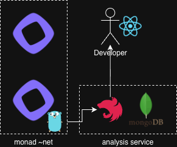

# Monad Flow

Monad Flow is a debugging and observability tool to trace, inspect, and visualize the data flow (packets) between the consensus client (`monad-bft`), execution layer (`monad-execution`), and the surrounding network.

---

## 1. Why we built this tool

### 1.1 The butterfly effect of a single log line

One of the scariest moments when operating blockchain nodes is when the system hesitates without a clear error code.

During Monad mainnet operations we encountered such a moment.  
At **12:01:51.723 UTC, round 49,293,139**, the consensus engine (`monad-bft`) tried to propose the next block, then abruptly stopped with the warning:

> no eth_header found

Later log analysis showed that the execution node (`monad-execution`) finished its work at **12:01:51.749 UTC** — only **26 ms (0.026 seconds)** after `monad-bft` tried to fetch the result.

That tiny delay was enough for the block proposal to fail and for the chain to briefly make no progress at all.

We did not treat this as “just latency”, but as a signal that something in the Monad chain’s own implementation was misbehaving in a way our existing monitoring could not explain. Monad Flow started as a project to help developers see and debug these kinds of issues by deeply tracing that missing 26 ms and similar incidents end-to-end.

### 1.2 The context: what is behind those 26 ms?

Using the open-source Monad codebase as a reference, we concluded that this incident was not a simple network glitch. It emerged from a complex interaction of internal components.

**Observed symptoms**

- **Log skips**: execution results were not written into `TrieDB` in time, causing `get_expected_execution_results` to fail.
- **Race between layers**: `monad-bft` was sometimes slightly ahead of `monad-execution`, hitting the window *before* execution had committed its state.

**Suspected technical root causes**

By correlating commit history with system behavior, we suspect at least three contributing factors:

- **TrieDB overhaul (refactor)**  
  Recent changes (e.g. around commit `b71f6d7d2`) significantly reworked the MPT / Trie layer.  
  The introduction of `shared_ptr` and updated lock management may have added runtime overhead to disk I/O and memory access patterns, creating subtle stalls.

- **Transaction processing changes**  
  A change around `f613802e1` started incrementing nonces even for accounts with insufficient balance.  
  This likely introduced unnecessary state writes, increasing load on `TrieDB` and the underlying storage.

- **Invisible bottlenecks**  
  Backlogs in the `txpool` (pending transactions) or `statesync` do not show up clearly in CPU usage graphs, yet they still consume execution thread resources and can delay critical work such as block header construction.

### 1.3 The problem: the code is visible, but the flow is not

We can read the code and reason about the logic, but answering  
**“Why does the system become slow at this exact moment in production?”**  
is a completely different challenge.

Traditional debugging approaches quickly hit their limits:

**Why current tools fail**

- **Granularity mismatch**  
  Tools like `sar` or Prometheus show averaged metrics at second-level (or coarser) resolution.  
  Our “culprit” is an I/O spike that lives in a **26 ms window**. It disappears inside those averages.

- **No cross-layer correlation**  
  It is hard to precisely align:
  - “disk I/O spiked here”
  - with “this specific C++ function (e.g. `TrieDb::commit`) executed here”  
  on a single, unified timeline across processes and nodes. Static code analysis alone cannot reveal lock contention patterns or the actual order in which resources are acquired at runtime.

- **Lack of dynamic execution context**  
  When we change logic (e.g. nonce handling) there is no quantitative way, with standard tools, to measure how much extra load that change adds to DB writes or to the execution pipeline as a whole.

### 1.4 Conclusion: from black box to deep trace

> If you can’t measure it, you can’t improve it.

The 26 ms delay is not just a bug; it is a symptom of the growing pains of a high-performance blockchain architecture.  
Even with open-source code, runtime behavior is far from transparent.

Monad Flow exists to close the gap between **code** and **infrastructure**:

- turning `monad-execution` (and its interaction with `monad-bft`) from a black box into a deeply traceable system,
- making execution-layer behavior observable at millisecond-level resolution,
- and giving operators an intuitive way to understand how design and code changes manifest in real-world performance.

---

## 2. What you can see with this tool

### 2.1 Metrics and views

- **Consensus ↔ execution latency view**  
  End-to-end latency between `monad-bft` and `monad-execution` (per round / block / transaction), including distributions and outliers around incidents like the “missing 26 ms”.

- **Function-level trace view**  
  Nanosecond-level execution time for critical functions (e.g. `TrieDb::commit`, `BlockExecutor::execute`), with caller/callee context and selected arguments so you can see *which* code paths actually dominate latency.

- **Timeline & correlation view**  
  A unified time axis showing logs, proposals, execution-complete events, off-CPU waits, scheduler delays, and hardware counters, making it possible to line up “this log line” with “this perf / eBPF / turbostat sample”.

- **Per-thread scheduler & blocking view**  
  Run-queue wait time, context-switch rates, and off-CPU blocking durations per thread (DB writer vs transaction processor vs P2P), to identify which parts of the node are really stalled.

- **CPU efficiency & hardware view**  
  IPC, cache misses, branch mispredictions, effective CPU frequency (busy vs avg MHz), power draw, and IRQ rates over time, to distinguish software bottlenecks from hardware throttling or interrupt storms.

- **Raptorcast packet & decoded data view**  
  Raw chunk packets sent and received over Raptorcast before decoding, plus the corresponding decoded Monad data (e.g. proposals, blocks, payloads), so you can see exactly what was “on the wire” and what it turned into at the protocol level.

- **Sender RTT view for chunk packets**  
  For each incoming pre-decoding Raptorcast chunk, the ping RTT to its sender, making it easy to relate packet-level latency and peer quality to higher-level consensus/execution delays.

### 2.2 How these metrics are made available

- **Dynamic binary instrumentation (DBI) – function-level tracing**
  - Attaches to a running `monad-execution` process (no rebuild or restart) and measures nanosecond-level execution time for critical functions such as `TrieDb::commit` or `BlockExecutor::execute`, including caller/callee context and selected arguments/return values.
  - Wraps Frida from Go to inject small JS payloads into C++ symbols and uses native `clock_gettime(CLOCK_MONOTONIC)` via `NativeFunction` plus `onEnter`/`onLeave` hooks to capture precise timings while keeping runtime overhead low.
- **Raptorcast packet capture & decoding**
  - Taps into Raptorcast traffic to capture raw chunk packets, associates them with their peers, and decodes them into higher-level Monad messages so both “pre-decoding wire data” and “post-decoding protocol data” can be inspected side by side.
  - Tracks and records ping RTT to each sender, exposing per-peer latency that can be correlated with packet timing, proposal delays, and execution behavior.
- **Real-time multi-service log stream** 
  - Merges logs from different processes (e.g. `monad-bft`, `monad-node`) onto a single timeline with microsecond timestamps, so you can see the exact order between proposals and execution-complete events.
  - Reads directly from the system journal (e.g. via Go `sdjournal`) instead of parsing `journalctl` output, and funnels all log events through a unified channel for basic real-time correlation.
- **Off-CPU & latency profiling** 
  - Focuses on **why** threads are not running on CPU (I/O wait, lock contention) rather than how busy the CPU is.
  - Samples blocking duration (µs) and associated stack traces (e.g. inside `TrieDb::commit` or `std::mutex::lock`) using eBPF/BCC `offcputime`, targeting the `monad-execution` process and aggregating waits per thread at ~1s intervals.
- **Micro-architectural efficiency profiling** 
  - Distinguishes between “useful work” and cycles wasted on memory access, by observing IPC, cache misses (L1 / LLC), and branch mispredictions.
  - Wraps `perf stat` with high-frequency sampling (e.g. `-I 500`) and parses its text output into structured metrics so short performance drops related to TrieDB cache behavior can be aligned with other time-series data.
- **Thread-level scheduler latency analysis** 
  - Looks at individual threads (e.g. DB writer vs transaction processor vs P2P) rather than just the overall process, to see which ones are actually being delayed.
  - Reads per-thread scheduler stats from `/proc/[pid]/task/[tid]/schedstat` at ~1s intervals and computes deltas, exposing run-queue wait time and context-switch rates so CPU saturation and scheduling imbalance can be detected with minimal overhead.
- **Hardware frequency & power-state analysis** 
  - Looks beyond OS-level CPU utilization to see whether cores are actually running at expected frequencies, or being throttled by power/thermal constraints or interrupt storms.
  - Wraps `turbostat` with a short interval (e.g. `--interval 0.5`) and parses its output to track effective clock (busy vs average MHz), package/core power (W), and IRQ rates as time-series metrics.

---

## 3. How to use and set up the tool

### 3.1 Architecture

### 3.2 Network Sidecar

- Captures raw network traffic (including Raptorcast chunk packets) from a given interface and sends structured events to the backend.
- See detailed setup, build, and PM2 run instructions in the [Network README](network/README.md).

### 3.3 System Sidecar

- Collects host‑level and process‑level metrics (off‑CPU waits, scheduler stats, perf/turbostat counters, DBI traces) for `monad-bft` / `monad-execution` and forwards them to the backend.
- See detailed environment, required tools, build, and PM2 instructions in the [System README](system/README.md).
---

### 3.2 Backend

#### 3.2.1 Running MongoDB and configuring the backend

- The backend is a NestJS service that ingests metrics from the sidecars and stores them in MongoDB.
- For detailed instructions on MongoDB environment variables, Docker Compose, build, and PM2 usage, see the [Backend README](backend/README.md).

---

### 3.3 Frontend

- Next.js frontend that visualizes Monad Flow metrics, traces, timelines, decoded Raptorcast data, and peer information.
- For details on creating `known-peers.ts` and running the app, see the [Frontend README](frontend/README.md).
